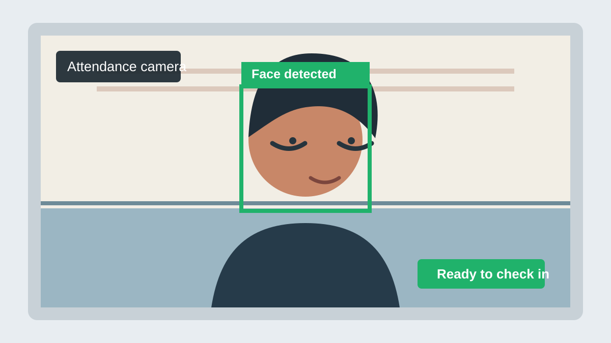

# Face Attendance

Ứng dụng điểm danh bằng nhận diện khuôn mặt, sử dụng webcam, InsightFace và SQLite.



## Tính năng

- Đăng ký người dùng bằng nhiều mẫu khuôn mặt.
- Nhận diện khuôn mặt từ webcam.
- Tự động ghi nhận điểm danh tối đa một lần mỗi ngày.
- Xem danh sách người dùng đã đăng ký.
- Xem lịch sử điểm danh.
- Lưu dữ liệu trong SQLite tại `data/attendance.db`.

## Yêu cầu

- Windows, Python 3.9 trở lên.
- Webcam.
- Các thư viện Python:
  - `opencv-python`
  - `numpy`
  - `insightface`
  - `onnxruntime`

## Cài đặt

Mở PowerShell tại thư mục project và chạy:

```powershell
py -3 -m venv venv
.\venv\Scripts\Activate.ps1
python -m pip install --upgrade pip
pip install opencv-python numpy insightface onnxruntime
```

Nếu PowerShell chặn việc kích hoạt môi trường ảo, có thể chạy trực tiếp bằng Python trong môi trường ảo:

```powershell
.\venv\Scripts\python.exe -m pip install opencv-python numpy insightface onnxruntime
```

## Chạy chương trình

```powershell
py -3 main.py
```

Trong menu:

1. Chọn `1` để đăng ký người dùng mới.
2. Nhập mã sinh viên và họ tên.
3. Nhìn vào webcam, chỉ để một khuôn mặt trong khung hình.
4. Chọn `2` để bắt đầu điểm danh.
5. Chọn `3` để xem danh sách người dùng.
6. Chọn `4` để xem lịch sử điểm danh.
7. Nhấn `Q` trong cửa sổ webcam để thoát.

Lần đầu chạy InsightFace có thể cần tải model `buffalo_l`, vì vậy quá trình khởi động có thể lâu hơn bình thường.

## Kiểm tra webcam

Để chỉ kiểm tra camera:

```powershell
py -3 test_camera.py
```

Để kiểm tra phát hiện khuôn mặt:

```powershell
py -3 face_engine.py
```

## Cấu trúc project

```text
face_attendance/
├── attendance.py      # Nhận diện và ghi nhận điểm danh
├── database.py        # SQLite và các thao tác dữ liệu
├── face_engine.py     # InsightFace và phát hiện khuôn mặt
├── main.py            # Menu chính
├── register.py        # Đăng ký người dùng
├── test_camera.py     # Kiểm tra webcam
└── data/
    └── attendance.db  # Cơ sở dữ liệu được tạo tự động
```

## Lưu ý

- Đảm bảo webcam không bị ứng dụng khác sử dụng.
- Đăng ký trong điều kiện ánh sáng đủ và nhìn nhiều hướng nhẹ để tăng độ ổn định.
- Ngưỡng nhận diện hiện tại nằm trong `attendance.py` với giá trị `SIMILARITY_THRESHOLD = 0.45`; cần hiệu chỉnh nếu nhận diện quá dễ hoặc quá khó.
